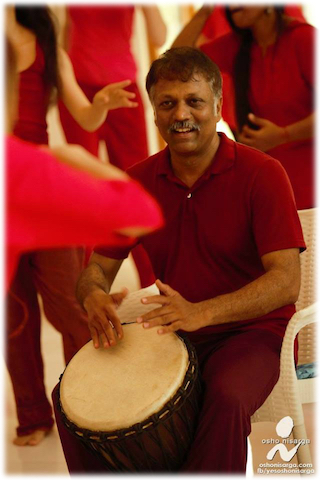

> Dance, when you're broken open.  
> Dance, if you've torn the bandage off.  
> Dance in the middle of fighting.  
> Dance in your blood.  
> Dance when you're perfectly free.  
> -- Rumi

### *Ashok Kumar is a professional theatre artist and an accomplished djembe player.*

<!--

  
    <section id="{{ post.name }}">
      

        {{ post.content }}
      

    </section>
  

-->
